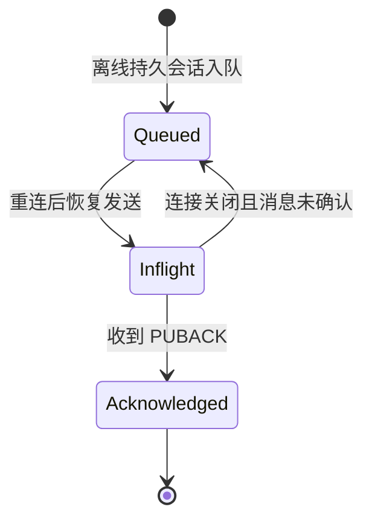

# 离线消息模型

本文档定义持久会话在离线期间的消息保留模型，以及重连后的恢复投递规则。

## 目标

- 为持久会话提供单机、内存态的离线消息恢复能力
- 让 QoS 1 的离线队列、出站 inflight 和重连恢复拥有统一归属
- 明确队列容量、淘汰策略和当前阶段边界

## 归属边界

- 离线消息状态属于 `session`
- `routing` 只负责找出目标订阅者，不负责保存消息
- `transport` 只负责实际发包和接收 `PUBACK`

## 消息状态图

## 当前模型

每个持久会话当前维护三类与 QoS 1 相关的状态：

- `subscriptions`
- `queuedMessages`
- `inflightMessages`

其中：

- `queuedMessages` 表示客户端离线时积压的待投递消息
- `inflightMessages` 表示已发送、等待订阅端 `PUBACK` 的 QoS 1 消息

## 入队规则

- 只有持久会话才保留离线消息
- 当前只积压最终投递 QoS 为 1 的消息
- QoS 0 消息在目标客户端离线时直接跳过
- 当前离线队列使用 FIFO 顺序

## 容量与淘汰

- 当前默认每个会话最多保留 `1024` 条离线消息
- 当离线队列达到上限时，采用“丢最旧”策略
- 目标是保留最近消息，而不是保证无限积压

## 重连恢复

- 持久会话重连成功后，离线队列中的消息按入队顺序恢复发送
- 恢复发送时，消息从 `queuedMessages` 转入 `inflightMessages`
- 恢复投递使用 QoS 1，并等待订阅端 `PUBACK`

## 连接关闭时的处理

- 若持久会话在线期间已有未确认的 QoS 1 消息，连接关闭时这些 inflight 消息会回退为离线队列
- 回退后的消息会标记为后续重投递
- 非持久会话关闭时，会话连同离线状态一并删除

## 当前阶段边界

当前已覆盖：

- 持久会话离线消息入队
- 重连后的恢复投递
- QoS 1 inflight 跟踪
- `PUBACK` 后完成确认
- 队列满时丢最旧

当前仍未覆盖：

- 消息过期
- 后台重试定时器
- 跨重启恢复
- QoS 2
