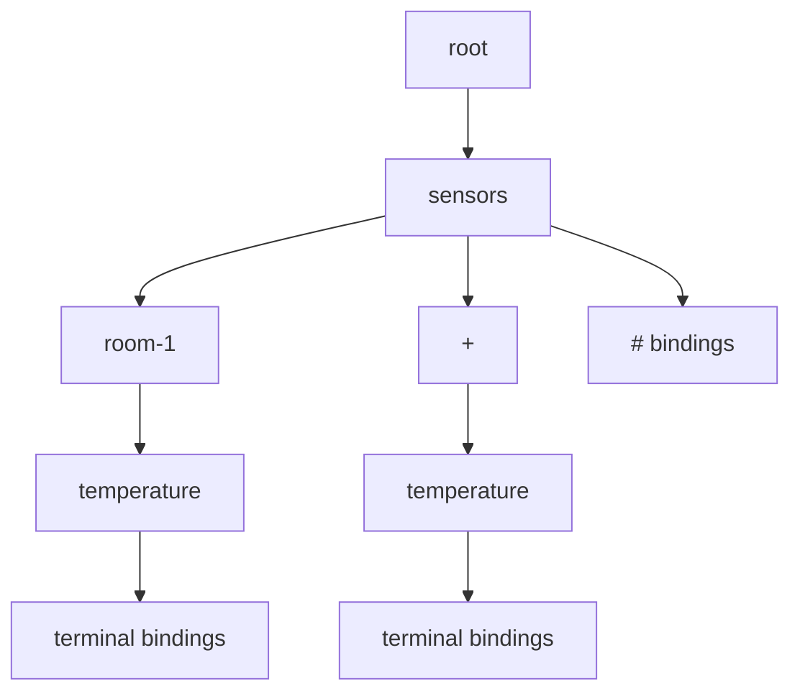

# 订阅树模型

本文档定义 Broker 在 `routing` 模块内部使用的订阅树模型。协议匹配流程看 [`../03-protocol/topic-match-flow.md`](../03-protocol/topic-match-flow.md)。

## 目标

- 用树结构替换当前线性扫描订阅索引
- 保持 MQTT Topic Filter 匹配语义严格正确
- 为后续订阅元数据扩展预留稳定承载位

## 核心结论

- 订阅真相仍然在 `session`
- 订阅树只是 `routing` 的派生索引
- 当前并发模型采用 `Event Loop 优先`
- 当前只实现基础订阅绑定，不实现 `Subscription Options`、`Shared Subscription`、订阅标识

## 节点结构

每个订阅树节点包含：

- `exactChildren`
  - 当前层精确 topic level 的子节点映射
- `singleLevelWildcardChild`
  - 当前层 `+` 通配符子节点
- `terminalBindings`
  - 当前路径完整结束后的绑定集合
- `multiLevelWildcardBindings`
  - 当前路径以 `#` 结束时挂载的绑定集合

## 结构图

## 插入规则

- 精确 level：进入 `exactChildren`
- `+`：进入 `singleLevelWildcardChild`
- `#`：不创建普通后续子树，直接在当前节点 `multiLevelWildcardBindings` 挂载终结绑定
- 同一 `clientId + topicFilter` 的后续订阅会覆盖旧绑定

## 删除与剪枝

- 删除时沿 topic path 递归回收
- 若子节点删除后已无任何子节点和绑定，则安全剪枝
- 当前只做安全剪枝，不做路径压缩或更激进的结构优化

## 匹配规则

- 匹配过程中同时检查：
- 当前节点上的 `multiLevelWildcardBindings`
- 当前层精确子节点
- 当前层 `+` 子节点
- topic path 结束后再检查 `terminalBindings`

## 重叠订阅去重

- 同一客户端的多个命中绑定仍只投递一次
- QoS 选择保持当前规则：命中绑定中选择 `grantedQos` 更高的那个

## 扩展位预留

当前 `SubscriptionBinding` 仍只包含：

- `clientId`
- `topicFilter`
- `grantedQos`

但树模型按“绑定挂在终结位置”组织，因此后续可以在绑定层扩展：

- `Subscription Options`
- `Subscription Identifier`
- 共享组信息

不需要推翻节点主体结构。

## 与其他模块的边界

- `session`
  - 保存订阅真相
- `routing`
  - 保存订阅索引与匹配路径
- `retained`
  - 不并入订阅树，只在订阅成功后复用 Topic Filter 匹配能力
- `transport`
  - 不感知订阅树结构，只消费最终匹配结果

## 当前实现边界

- 当前为单机、内存态订阅树
- 当前不承诺并发读写安全
- 当前已包含一套与线性扫描实现对比的 benchmark harness
