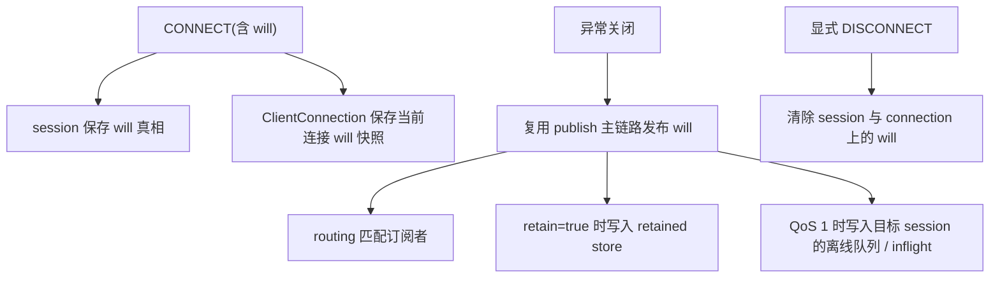

# Will Message 模型

本文档定义 Broker 内部如何保存和消费 Will Message。协议触发条件看 [`../03-protocol/will-flow.md`](../03-protocol/will-flow.md)。

## 目标

- 明确 Will 的状态归属
- 明确 Will 与 `session`、`routing`、`retained` 的边界
- 明确当前单机、内存态实现的最小模型

## 核心结论

- Will 是会话状态的一部分，长期真相归 `session`
- `ClientConnection` 会额外保留一份当前连接的 will 快照，用于连接接管和异常关闭时按连接维度触发
- `routing` 不保存 will，只负责 will 发布后的订阅匹配
- `retained` 不保存 will 的独立真相；只有 `will.retain=true` 且 will 被真正发布时，才通过 retained store 落盘到当前进程内存

## 模型结构

Will 当前最小字段：

- `topicName`
- `payload`
- `qos`
- `retain`

当前阶段不纳入模型的字段：

- `Will Delay Interval`
- MQTT 5 Will Properties
- Message Expiry Interval

## 状态归属图

## session 与 connection 的分工

### session

- 保存当前会话生效中的 will
- 在新 CONNECT 覆盖旧会话或 fresh-start 时一起替换
- 在显式 `DISCONNECT` 时清除

### ClientConnection

- 保存“这个活跃连接自己的 will 快照”
- 连接真正关闭时用于决定是否触发发布
- 解决连接接管场景下“旧连接关闭时仍应发布旧 will”的问题

## 与其他模块的边界

### routing

- 不存 will
- will 发布后与普通 publish 一样进入订阅匹配

### retained

- 不知道“这是不是 will”
- 只在 will 被发布且 `retain=true` 时按普通 retained publish 处理

### transport

- 只负责从 CONNECT 提取 will 字段
- 只负责在 close 后发送协议层返回的 will deliveries
- 不持有 will 真相

## 当前实现边界

- 当前为单机、内存态 will
- 当前只支持立即触发的基础 will
- 当前不支持延迟发布、跨重启保留或高级 MQTT 5 will 属性
