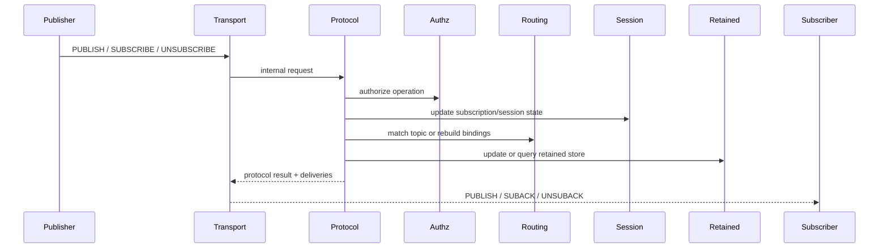

# 消息投递

本文档定义 Broker 对发布、订阅、匹配、QoS 1、retained 和 will 的长期协议行为。它回答“消息从进入 Broker 到最终投递，会经过哪些协议决策和状态分支”。

边界：本文描述 Broker 对 MQTT 发布订阅相关报文和消息语义的外部行为；内部模块职责和状态归属见 [`system-design.md`](system-design.md) 与 [`state-and-routing.md`](state-and-routing.md)。

## 目的与范围

- 定义入站 PUBLISH 的处理与投递规则。
- 定义 SUBSCRIBE / UNSUBSCRIBE 的更新与投递副作用。
- 定义 Topic Filter 匹配、重叠订阅去重和 QoS 1 / QoS 2 完成语义。
- 定义 retained 与 will 如何复用普通消息投递主链路。

## 投递主线

## 发布路径

### 输入字段

- `topicName`
- `qos`
- `packetId`
- `retain`
- `dup`
- `payload`
- MQTT 5 PUBLISH properties：当前支持 `User Property`、`Message Expiry Interval`、`Response Topic` 和 `Correlation Data`

### 处理流程

1. `transport` 将入站报文转换为 `PublishRequest`。
2. `protocol` 校验 Topic Name 与当前支持的 QoS。
3. `authz` 检查 publish 权限；当前默认 authorizer 放行。
4. `retain=true` 时，`protocol` 先更新 retained store。
5. `routing` 根据 Topic Name 解析命中订阅集合。
6. `protocol` 决定每个目标是在线立即投递、离线入队还是跳过。
7. `transport` 查找在线 endpoint，并执行实际出站写回。
8. QoS 1 场景下，`transport` 负责回 `PUBACK` 并接收订阅端 `PUBACK`。
9. QoS 2 场景下，`transport` 和 `protocol/session` 协作完成 `PUBREC / PUBREL / PUBCOMP` 状态机。

### 投递规则

- 只有当前仍处于活跃状态的连接会收到在线消息。
- 若目标会话无在线连接且为持久会话，最终投递 QoS 为 1 或 2 的消息会进入离线队列。
- 若目标会话无在线连接且为非持久会话，当前直接跳过。
- 若发布者同时也是订阅者，默认允许收到自己发布的消息；MQTT 5 `No Local` 订阅会跳过同 `clientId` 发布者。
- `Retain As Published=false` 的 MQTT 5 订阅会在普通在线/离线投递中清除出站 `retain` 标志；`true` 时保留入站发布的 `retain` 标志。
- 同一客户端命中重叠订阅时，当前只投递一次。
- MQTT 5 `Subscription Identifier` 会随在线、离线恢复和 retained replay 投递下发；同一客户端多个命中订阅会合并到同一出站 PUBLISH 的多个 identifier 属性。
- MQTT 5 PUBLISH `User Property` 会按入站顺序透传；重复 key 不会合并或去重。
- `User Property` 会随在线投递、离线恢复、retained replay 和 QoS 2 延迟路由保留。
- MQTT 5 PUBLISH `Message Expiry Interval` 会在 Broker 接收 PUBLISH 时转换为内部过期时间。
- 已过期消息不会在线投递、离线入队或 retained replay；QoS 1 / QoS 2 协议确认仍按对应状态机完成。
- MQTT 5 `Response Topic` 会作为 Topic Name 校验；空值、通配符或重复 `Response Topic` / `Correlation Data` 会触发协议错误断连。
- MQTT 5 `Response Topic` 和 `Correlation Data` 会随在线投递、离线恢复、retained replay、QoS 2 延迟路由和 will 发布原样透传。
- 出站 MQTT 5 PUBLISH 会写回剩余 `Message Expiry Interval`，并可与 `User Property`、`Subscription Identifier`、`Response Topic` 和 `Correlation Data` 同时存在。

## Request-Response Pattern

- Broker 将携带 `Response Topic` 的 MQTT 5 PUBLISH 视为 request-response 模式中的请求消息，但不维护请求表、不等待响应、不生成响应消息。
- 请求发送方负责先订阅自己的响应主题，再发布携带 `Response Topic` 的请求。
- 响应方收到请求后，应用层负责向 `Response Topic` 发布响应，并按需复制 `Correlation Data`。
- 请求发送方负责用 `Correlation Data` 匹配响应、处理超时和重试。
- 鉴权仍复用现有 SUBSCRIBE / PUBLISH 链路；Broker 不因 `Response Topic` 自动授予任何订阅或发布权限。

## 订阅路径

### SUBSCRIBE

1. `transport` 接收 SUBSCRIBE 并调用 `protocol`。
2. `protocol` 校验每个 Topic Filter 与请求 QoS。
3. `authz` 检查 subscribe 权限；当前默认 authorizer 放行。
4. `session` 更新订阅真相，`routing` 重建或更新匹配索引。
5. 对每个成功注册的 Topic Filter，`retained` 查询命中的 retained 消息。
6. `transport` 先发送 SUBACK，再发送 retained deliveries。

当前行为：

- 当前支持 QoS 0 / QoS 1 / QoS 2 订阅授予。
- 当前 retained 下发发生在 SUBACK 之后，并受 MQTT 5 `Retain Handling` 控制。
- 当前会保存 MQTT 5 `No Local`、`Retain As Published`、`Retain Handling` 和 `Subscription Identifier`。
- MQTT 5 SUBSCRIBE `User Property` 会进入内部 `SubscriptionRequest.properties`，当前仅建模供后续策略扩展使用，不改变订阅结果。

### UNSUBSCRIBE

- `protocol` 从会话真相和路由索引中移除对应订阅。
- `transport` 返回按协议版本映射的 UNSUBACK。
- MQTT 5 UNSUBSCRIBE `User Property` 会进入内部 `UnsubscribeRequest.properties`，当前仅建模供后续策略扩展使用，不改变取消订阅结果。

## 鉴权边界

- SUBSCRIBE 在 Topic Filter / QoS 校验之后、会话和路由状态写入之前执行鉴权。
- PUBLISH 在 Topic Name / QoS 校验之后、retained 写入、路由匹配和 QoS 2 入站事务保存之前执行鉴权。
- CONNECT Will 在连接接受和会话状态写入之前执行 publish 鉴权。
- 鉴权上下文包含 `clientId`、认证后的 principal、操作类型和 topic。
- 当前 M3-10 只接入 `AuthzProvider` / `AuthzChain`，默认 permit-all，不提供实际 ACL 规则。
- 后续若鉴权拒绝，协议层必须避免写入订阅、路由、retained、离线队列和 QoS 2 入站事务状态。

## Topic 匹配与去重

- `routing` 同时检查精确路径、`+` 子节点和当前节点上的 `#` 绑定。
- 最终命中集合会按 `clientId` 去重。
- 若同一客户端命中多个订阅，最终投递 QoS 取更高 `grantedQos`。
- 若同一客户端命中多个带 Subscription Identifier 的订阅，最终单次投递会携带所有命中的 identifier。

## QoS 1 语义

- 当前 Broker 接受入站 QoS 0 和 QoS 1。
- 在线 QoS 1 出站消息会进入目标会话的 inflight 跟踪。
- 订阅端收到 QoS 1 消息后，由 MQTT 客户端库自动回 `PUBACK`。
- Broker 在收到 `PUBACK` 后完成对应 inflight 确认。
- MQTT 5 出站 QoS 1 会遵守订阅端 CONNECT 中的 `Receive Maximum`；窗口已满时进入会话内 pending 队列，收到 `PUBACK` 后继续下发。
- MQTT 5 出站 QoS 1 会遵守订阅端 CONNECT 中的 `Maximum Packet Size`；包大小超过订阅端限制时跳过投递，不创建 inflight。
- 若连接先关闭，则未确认 inflight 消息回退为离线队列。
- 当前不做后台超时重试。

## QoS 2 语义

- 当前 Broker 接受入站 QoS 2，并按 `PUBLISH -> PUBREC -> PUBREL -> PUBCOMP` 完成 exactly-once 状态机。
- 入站 QoS 2 的 `PUBLISH` 会先保存事务并返回 `PUBREC`，不会立即路由。
- 收到对应 `PUBREL` 后，Broker 才执行 retained 更新、订阅匹配和实际投递，并返回 `PUBCOMP`。
- 若 QoS 2 入站 PUBLISH 在 `PUBREL` 前过期，Broker 仍完成 `PUBCOMP`，但不执行 retained 写入或订阅投递。
- 重复 `PUBLISH(QoS2)` 会复用已保存事务并再次返回 `PUBREC`，不会重复保存 payload。
- MQTT 5 入站 QoS 2 事务数量受 Broker `receive-maximum` 配置限制；不同 packet id 超限时返回 `DISCONNECT(RECEIVE_MAXIMUM_EXCEEDED)`。
- 重复或未知 `PUBREL` 会返回 `PUBCOMP`，但不会重复投递。
- 在线 QoS 2 出站消息会进入目标会话 inflight 状态；订阅端 `PUBREC` 后 Broker 发送 `PUBREL`，订阅端 `PUBCOMP` 后清理 inflight。
- MQTT 5 出站 QoS 2 同样遵守订阅端 `Receive Maximum`；窗口已满时进入 pending 队列，收到 `PUBCOMP` 后继续下发。
- MQTT 5 出站 QoS 2 同样遵守订阅端 `Maximum Packet Size`；包大小超过订阅端限制时跳过投递，不创建 inflight。
- 持久会话断线时，未完成的出站 QoS 2 状态会保留；重连后按阶段重发 `PUBLISH(dup=true)` 或 `PUBREL`。
- 离线持久会话的 QoS 2 消息会排队，并在重连后转换为出站 QoS 2 inflight。
- 当前不做后台超时重试，也不做跨 Broker 进程重启恢复。

## Retained 语义

- `retain=true` 且 payload 非空时，按 Topic Name 写入或覆盖 retained store。
- `retain=true` 且 payload 为空时，删除该 Topic Name 的 retained 记录。
- retained 发布本身仍继续走普通在线投递或离线 QoS 1 / QoS 2 入队路径。
- 订阅成功后，命中的 retained 消息会在 SUBACK 之后立即下发。
- 带 `Message Expiry Interval` 的 retained 消息过期后不会下发；当前在 retained replay 路径做懒删除，不引入后台清理任务。
- MQTT 5 `Retain Handling` 已支持 `SEND_AT_SUBSCRIBE`、`SEND_AT_SUBSCRIBE_IF_NOT_YET_EXISTS` 和 `DONT_SEND_AT_SUBSCRIBE`。
- MQTT 5 `Retain Available` 当前未实现。

## Will 语义

- CONNECT 携带 will 时，Broker 保存 will。
- CONNECT Will 会在连接接受前经过 publish 鉴权；当前默认 authorizer 放行。
- 显式 `DISCONNECT` 不触发 will。
- 网络断开、Keep Alive 超时、协议错误断连和连接接管导致的旧连接关闭都可能触发 will。
- will 被转换为内部 `PublishRequest`，并复用普通 `PUBLISH` 主链路。
- MQTT 5 Will Properties 当前会提取 `User Property`、`Response Topic` 和 `Correlation Data`，并在 will 触发发布时作为 PUBLISH 属性透传。
- MQTT 5 Will Message Expiry Interval 当前未实现；will 不会在 CONNECT 时启动消息过期倒计时。
- 因此 will 自动继承：
  - Topic 匹配
  - 在线投递
  - 离线持久会话的 QoS 1 入队
  - `retain=true` 时写入 retained store
  - `User Property`、`Response Topic` 和 `Correlation Data` 在线下发、离线恢复和 retained replay
- 当前 will QoS 2 尚未纳入实现；will 解析仍将非 QoS 0 映射为 QoS 1。

## 协议版本差异

- MQTT 3.1.1 与 MQTT 5 的发布订阅主链路基本一致。
- MQTT 5 在当前实现中会返回显式 reason code 或 `PUBACK(Success)`；MQTT 3.1.1 使用基础返回报文或直接关闭连接。
- MQTT 5 出站 PUBLISH 会携带当前支持的 properties；MQTT 3.1.1 出站路径不会写 MQTT 5 properties。
- MQTT 3.1.1 不解析也不写 `Message Expiry Interval`、`Response Topic` 或 `Correlation Data`。
- 差异主要体现在异常断连、reason code 表达和 MQTT 5 属性，而不是基础投递主流程。

## 当前实现边界

- 当前支持入站和出站 QoS 0 / QoS 1 / QoS 2。
- 当前支持 retained 写入、覆盖、清除与订阅后下发。
- 当前支持基础 will 保存、显式断连抑制和异常关闭发布。
- 当前支持离线 QoS 1 积压与重连恢复。
- 当前支持 retained QoS 2 存储与重放，但 will QoS 2 延后。
- 当前支持 Subscription Options、Subscription Identifier、CONNECT / SUBSCRIBE / UNSUBSCRIBE request properties 建模、PUBLISH / Will User Property 透传、PUBLISH Message Expiry Interval 和 MQTT 5 request-response 属性透传。
- 当前已接入 SUBSCRIBE、PUBLISH 和 CONNECT Will 鉴权链；默认 authorizer 放行，尚无实际 ACL 规则。
- 当前不支持 CONNACK / SUBACK / UNSUBACK / DISCONNECT 等出站或非入站 request 的 User Property、共享订阅、Will Message Expiry 和除 Will User Property / Response Topic / Correlation Data 外的高级 MQTT 5 will / retain 属性。
