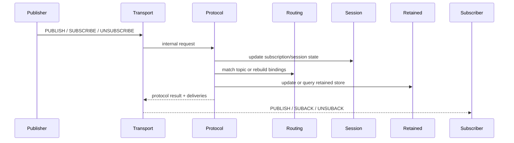

# 消息投递

本文档定义 Broker 对发布、订阅、匹配、QoS 1、retained 和 will 的长期协议行为。它回答“消息从进入 Broker 到最终投递，会经过哪些协议决策和状态分支”。

边界：本文描述 Broker 对 MQTT 发布订阅相关报文和消息语义的外部行为；内部模块职责和状态归属见 [`system-design.md`](system-design.md) 与 [`state-and-routing.md`](state-and-routing.md)。

## 目的与范围

- 定义入站 PUBLISH 的处理与投递规则。
- 定义 SUBSCRIBE / UNSUBSCRIBE 的更新与投递副作用。
- 定义 Topic Filter 匹配、重叠订阅去重和 QoS 1 完成语义。
- 定义 retained 与 will 如何复用普通消息投递主链路。

## 投递主线

## 发布路径

### 输入字段

- `topicName`
- `qos`
- `packetId`
- `retain`
- `dup`
- `payload`

### 处理流程

1. `transport` 将入站报文转换为 `PublishRequest`。
2. `protocol` 校验 Topic Name 与当前支持的 QoS。
3. `retain=true` 时，`protocol` 先更新 retained store。
4. `routing` 根据 Topic Name 解析命中订阅集合。
5. `protocol` 决定每个目标是在线立即投递、离线入队还是跳过。
6. `transport` 查找在线 endpoint，并执行实际出站写回。
7. QoS 1 场景下，`transport` 负责回 `PUBACK` 并接收订阅端 `PUBACK`。

### 投递规则

- 只有当前仍处于活跃状态的连接会收到在线消息。
- 若目标会话无在线连接且为持久会话，最终投递 QoS 为 1 的消息会进入离线队列。
- 若目标会话无在线连接且为非持久会话，当前直接跳过。
- 若发布者同时也是订阅者，当前允许收到自己发布的消息。
- 同一客户端命中重叠订阅时，当前只投递一次。

## 订阅路径

### SUBSCRIBE

1. `transport` 接收 SUBSCRIBE 并调用 `protocol`。
2. `protocol` 校验每个 Topic Filter 与请求 QoS。
3. `session` 更新订阅真相，`routing` 重建或更新匹配索引。
4. 对每个成功注册的 Topic Filter，`retained` 查询命中的 retained 消息。
5. `transport` 先发送 SUBACK，再发送 retained deliveries。

当前行为：

- 当前支持 QoS 0 / QoS 1 订阅授予；请求 QoS 2 时当前降为 QoS 1。
- 当前 retained 下发固定发生在 SUBACK 之后。

### UNSUBSCRIBE

- `protocol` 从会话真相和路由索引中移除对应订阅。
- `transport` 返回按协议版本映射的 UNSUBACK。

## Topic 匹配与去重

- `routing` 同时检查精确路径、`+` 子节点和当前节点上的 `#` 绑定。
- 最终命中集合会按 `clientId` 去重。
- 若同一客户端命中多个订阅，最终投递 QoS 取更高 `grantedQos`。

## QoS 1 语义

- 当前 Broker 接受入站 QoS 0 和 QoS 1。
- 在线 QoS 1 出站消息会进入目标会话的 inflight 跟踪。
- 订阅端收到 QoS 1 消息后，由 MQTT 客户端库自动回 `PUBACK`。
- Broker 在收到 `PUBACK` 后完成对应 inflight 确认。
- 若连接先关闭，则未确认 inflight 消息回退为离线队列。
- 当前不做后台超时重试。

## Retained 语义

- `retain=true` 且 payload 非空时，按 Topic Name 写入或覆盖 retained store。
- `retain=true` 且 payload 为空时，删除该 Topic Name 的 retained 记录。
- retained 发布本身仍继续走普通在线投递或离线 QoS 1 入队路径。
- 订阅成功后，命中的 retained 消息会在 SUBACK 之后立即下发。
- MQTT 5 的 `Retain Handling` 和 `Retain Available` 当前未实现。

## Will 语义

- CONNECT 携带 will 时，Broker 保存 will。
- 显式 `DISCONNECT` 不触发 will。
- 网络断开、Keep Alive 超时、协议错误断连和连接接管导致的旧连接关闭都可能触发 will。
- will 被转换为内部 `PublishRequest`，并复用普通 `PUBLISH` 主链路。
- 因此 will 自动继承：
  - Topic 匹配
  - 在线投递
  - 离线持久会话的 QoS 1 入队
  - `retain=true` 时写入 retained store

## 协议版本差异

- MQTT 3.1.1 与 MQTT 5 的发布订阅主链路基本一致。
- MQTT 5 在当前实现中会返回显式 reason code 或 `PUBACK(Success)`；MQTT 3.1.1 使用基础返回报文或直接关闭连接。
- 差异主要体现在异常断连、reason code 表达和后续高级属性，而不是基础投递主流程。

## 当前实现边界

- 当前支持入站和出站 QoS 0 / QoS 1。
- 当前支持 retained 写入、覆盖、清除与订阅后下发。
- 当前支持基础 will 保存、显式断连抑制和异常关闭发布。
- 当前支持离线 QoS 1 积压与重连恢复。
- 当前不支持 QoS 2。
- 当前不支持 Subscription Options、Subscription Identifier、共享订阅和高级 MQTT 5 will / retain 属性。
