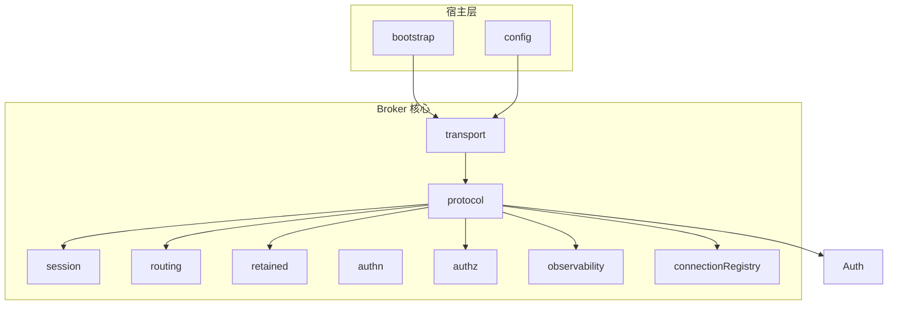

# 系统设计

本文档描述 `vxmq` 的长期架构骨架、模块边界和关键约束。它回答“系统由哪些模块组成、谁负责什么、模块之间如何协作”。

边界：本文只描述系统结构与模块协作；Broker 对 MQTT 报文的外部行为见 [`connection-lifecycle.md`](connection-lifecycle.md) 和 [`message-delivery.md`](message-delivery.md)。

## 设计目标

- 保持协议主链路与 MQTT 规范语义对齐。
- 让 Quarkus 负责生命周期、配置和依赖注入，让 Broker 核心逻辑保持清晰边界。
- 在单机、内存态实现的基础上，为后续 QoS 2、持久化、鉴权和运维能力预留扩展空间。
- 把传输层、协议决策层和状态归属层分离，避免网络 API 直接扩散到所有模块。

## 已确定的技术约束

- 传输栈使用 `Vert.x MQTT server`。
- 主链路采用响应式、非阻塞、event-loop-first 模型。
- 在 Quarkus 中接入 Vert.x 扩展时，优先使用 Mutiny 变体。
- 当前实现是单机、内存态 Broker，不包含跨重启恢复。

## 模块视图

## 模块职责

### `bootstrap`

- 对接 Quarkus 生命周期。
- 启动和停止 Broker transport。

### `config`

- 提供 broker 监听地址、端口、包大小限制和连接超时等运行配置。

### `transport`

- 持有 `MqttServer` 与在线 `MqttEndpoint`。
- 接收 MQTT 报文回调并转换为内部请求对象。
- 将协议处理结果映射为 CONNACK、SUBACK、UNSUBACK、PUBLISH 或断连动作。

边界：

- 不保存会话真相。
- 不定义 Topic 匹配规则。
- 不直接修改订阅、retained 或会话状态，必须通过 `protocol`。

### `protocol`

- 聚合 CONNECT、SUBSCRIBE、UNSUBSCRIBE、PUBLISH、DISCONNECT 与连接关闭的处理决策。
- 组合 `authn`、`authz`、`session`、`routing`、`retained`、`connectionRegistry` 和 `observability`。
- 输出标准化结果模型，供 `transport` 映射为具体报文行为。

### `session`

- 管理按 `clientId` 归属的会话视图。
- 保存会话持久性、订阅集合、会话过期、离线 QoS 1 队列、QoS 1 inflight 与基础 will 状态。
- 作为订阅真相所有者，回答“某个 clientId 当前拥有什么会话状态和订阅状态”。

### `routing`

- 管理订阅索引与 Topic Filter 匹配。
- 基于会话真相派生匹配视图，回答“某个 Topic Name 当前命中了谁”。
- 当前主线实现采用 `snapshot / copy-on-write` 方案保证并发读写下的索引一致性。

### `retained`

- 保存按 Topic Name 建立的 retained 真相。
- 负责 retained 消息的写入、覆盖、清除和订阅后查询。
- 不保存订阅状态，也不参与普通在线订阅匹配。

### `authn`

- 提供客户端认证链。
- 当前支持配置驱动的 static username/password backend。
- Broker 默认配置保持 permit-all；启用认证资源后若未显式设置 no-match，链未匹配按 fail-closed 拒绝。
- 认证资源以有序、可启停 definition 建模，为未来后台管理系统运行时创建、排序和启停预留边界。
- 可从 `ConnectRequest` 读取 MQTT 5 CONNECT `User Property`，供后续认证插件使用。

### `authz`

- 提供客户端操作鉴权 provider 和鉴权链。
- 当前已接入 CONNECT Will、SUBSCRIBE 和 PUBLISH 主链路。
- 鉴权上下文包含 `clientId`、认证后的 principal、操作类型和 topic。
- Broker 默认配置保持 permit-all，不提供实际 ACL 规则；后续启用鉴权资源后若未显式设置 no-match，链未匹配按 fail-closed 拒绝。
- 后续 ACL、HTTP、SQL 或缓存型 authorizer 应复用同一 `AuthzProvider` 边界。

### `observability`

- 记录连接接受、协议诊断、订阅变更、消息路由等关键事件。
- 维护 Broker runtime state 快照，暴露 `DISABLED / STOPPED / STARTING / RUNNING / STOPPING / FAILED` 等 transport 生命周期状态。
- 通过 Quarkus SmallRye Health 提供 `/q/health/live` 与 `/q/health/ready`；readiness 采用严格 Broker 语义，只有 MQTT transport 已成功监听时才就绪。
- 通过 Quarkus Micrometer Prometheus 提供 `/q/metrics`，暴露低基数 VXMQ 指标：
  - gauges：`vxmq_connections_active`、`vxmq_sessions_total`、`vxmq_broker_ready`、`vxmq_broker_live`、`vxmq_broker_transport_state{state=...}`。
  - counters：`vxmq_connections_accepted_total`、`vxmq_messages_routed_total`、`vxmq_message_delivery_matches_total`、`vxmq_subscriptions_added_total`、`vxmq_subscriptions_removed_total`、`vxmq_protocol_warnings_total`、`vxmq_transport_starts_total`、`vxmq_transport_stops_total`。
  - 消息速率不在应用内维护滑动窗口，由 Prometheus 查询层使用 `rate(vxmq_messages_routed_total[1m])` 计算。
- 诊断日志通过 `BrokerDiagnosticEvent` 输出稳定 `key=value` 字段；`WARN` 和 `ERROR` 诊断事件计入 `vxmq_protocol_warnings_total`，`INFO` 事件仅写日志。
- 诊断日志不建模密码、payload、correlation data 或 user properties；排障入口见 [`operations-diagnostics.md`](operations-diagnostics.md)。

### `connectionRegistry`

- 管理当前活跃连接索引。
- 支撑连接接管、在线连接查找和连接级状态生命周期。

## 关键状态归属

- 连接级状态由 `transport / connectionRegistry` 持有。
  - 连接 ID、协议版本、活跃 endpoint、连接生命周期。
- 会话级状态由 `session` 持有。
  - `clientId`、当前绑定连接 ID、是否持久、会话过期、订阅集合、离线 QoS 1、inflight、will。
- 路由级索引由 `routing` 持有。
  - Topic Filter 到订阅绑定的匹配索引。
- Retained 真相由 `retained` 持有。
  - Topic Name 到 retained 消息的映射。

判断标准是“状态归属和执行模型”，而不是所有模块使用同一种同步手段。

## 并发与执行模型

- Broker 主链路建立在 Vert.x event loop 上，连接建立、报文回调、断连与 close 事件默认按 event loop 顺序推进。
- `ClientConnection` 属于连接级轻量状态对象，优先依赖 event loop 串行语义；少量跨线程可见字段使用 `volatile`。
- `session` 属于跨连接共享状态，对离线队列、QoS inflight、packet id 分配和 will 清除/提取等复合可变状态使用显式同步保护原子性。
- `routing` 是索引层，不强制复用连接层或会话层的并发策略；当前采用 snapshot/copy-on-write 主线实现，避免读路径被写锁阻塞。

## 模块协作主线

### 连接建立

1. `transport` 接收 CONNECT 并转换为内部 `ConnectRequest`。
2. `protocol` 校验协议、执行认证、解析 `clientId`，并在 CONNECT Will 存在时执行 publish 鉴权。
3. `protocol` 决定新建会话、恢复会话或接管旧连接。
4. `session` 与 `connectionRegistry` 更新连接归属。
5. `transport` 按版本差异返回 CONNACK，并在必要时关闭旧连接。

### 发布订阅

1. `transport` 接收 SUBSCRIBE、UNSUBSCRIBE 或 PUBLISH。
2. `protocol` 完成语义校验，并对 SUBSCRIBE / PUBLISH 执行操作鉴权。
3. `protocol` 在鉴权通过后更新 `session`、`routing`、`retained`。
4. `routing` 解析命中订阅集合，`retained` 负责 retained 查询或更新。
5. `transport` 根据在线 endpoint 执行实际消息投递。

### 断连

1. `transport` 接收主动断连、连接关闭或 Keep Alive 超时事件。
2. `protocol` 更新连接和会话状态，并按持久策略决定保留或删除会话。
3. 若满足条件，`protocol` 触发 will 发布并复用普通消息投递主链路。
4. `transport` 清理在线 endpoint 索引。

## 当前扩展方向

- QoS 2 状态机。
- MQTT 5 订阅增强能力与关键属性。
- 外部认证后端与实际 ACL 鉴权规则。
- 健康检查、指标和结构化诊断日志。
- 持久化与跨重启恢复。
