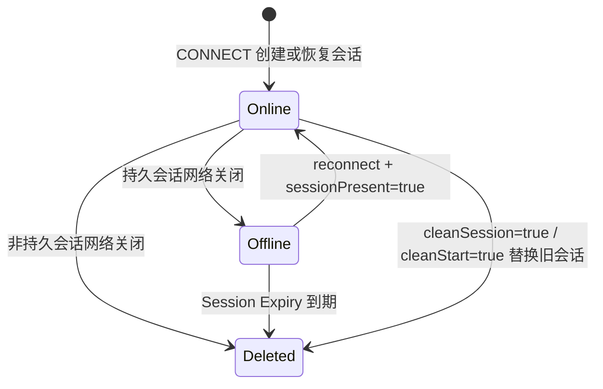

# 会话生命周期

本文档定义 Broker 在连接建立、断连、重连和会话过期场景下的长期行为规则。会话数据结构看 [`../02-architecture/session-model.md`](../02-architecture/session-model.md)。

## 目的

- 明确 MQTT 3.1.1 与 MQTT 5 的会话开启与恢复语义
- 明确主动断连、网络关闭和连接接管后的会话处理规则
- 明确 `sessionPresent` 的返回条件

## 生命周期关注点

本文档不重复定义会话字段和内部存储结构，只关注这些事件发生时 Broker 如何处理会话：

- CONNECT
- DISCONNECT
- 网络关闭
- reconnect
- session expiry

在内部 CONNECT 建模中，`cleanSession` 和 `cleanStart` 显式区分字段适用性：MQTT 3.1.1 只使用 `cleanSession`，MQTT 5 只使用 `cleanStart`，不适用字段为 `null`。

## 生命周期状态图

这里的 `Online / Offline / Deleted` 是协议语义上的生命周期状态；这些状态在内部如何落到字段，由 [`../02-architecture/session-model.md`](../02-architecture/session-model.md) 定义。

## CONNECT 打开或恢复会话

### MQTT 3.1.1 `cleanSession=true`

- 连接成功前先删除同 `clientId` 的旧会话
- 创建新会话
- 新会话为非持久会话
- `sessionPresent=false`

### MQTT 3.1.1 `cleanSession=false`

- 尝试恢复既有会话
- 若存在既有会话，则恢复该会话并返回 `sessionPresent=true`
- 若不存在，则创建新的持久会话并返回 `sessionPresent=false`

### MQTT 5 `cleanStart=true`

- 连接成功前先删除同 `clientId` 的旧会话
- 按本次 CONNECT 的 `Session Expiry Interval` 创建新会话
- `sessionPresent=false`

### MQTT 5 `cleanStart=false`

- 尝试恢复既有会话
- 若存在既有会话，则恢复该会话并返回 `sessionPresent=true`
- 若不存在，则创建新会话并返回 `sessionPresent=false`
- 新会话是否持久，取决于本次 CONNECT 的 `Session Expiry Interval`

## MQTT 5 Session Expiry 规则

- 若 CONNECT 未携带 `Session Expiry Interval`，按 `0` 处理
- `Session Expiry Interval=0`：连接关闭后立即删除会话
- `Session Expiry Interval>0`：连接关闭后保留离线会话，并记录到期时间

## 主动断连与网络关闭

### DISCONNECT

- 客户端发送 `DISCONNECT` 时，连接先进入 `DISCONNECTING`
- 当前连接上的 will 被立即清除
- 会话删除或保留的最终决策仍在“连接真正关闭”时执行
- 这样可以避免在接管或传输层收尾过程中提前破坏新连接会话

### 网络关闭

- 当连接真正关闭时，Broker 按会话策略执行：
- 非持久会话：立即删除
- MQTT 3.1.1 持久会话：转为离线并无限期保留
- MQTT 5 且 `Session Expiry Interval=0`：立即删除
- MQTT 5 且 `Session Expiry Interval>0`：转为离线并记录 `expiresAt`
- 若持久会话存在未确认的 QoS 1 inflight 消息，这些消息会回退为离线队列
- 若连接不是显式 `DISCONNECT` 结束，则会触发基础 Will Message 发布

## 重复 clientId 接管

- 新连接成功后，旧连接被判定为被接管连接
- MQTT 3.1.1：旧连接直接关闭
- MQTT 5：旧连接发送 `DISCONNECT(Session taken over)` 后关闭
- 旧连接关闭时，若当前会话已经被新连接重新绑定，则旧连接不得删除或离线化该会话

## 会话过期

- 当前实现不做后台定时回收
- 当 Broker 访问离线会话时，若发现 `expiresAt` 已到，则立即删除该会话
- 过期会话被删除后，后续同 `clientId` 连接视为新建会话

## 当前阶段不包含的行为

- Will Delay Interval
- 持久化与跨重启恢复
