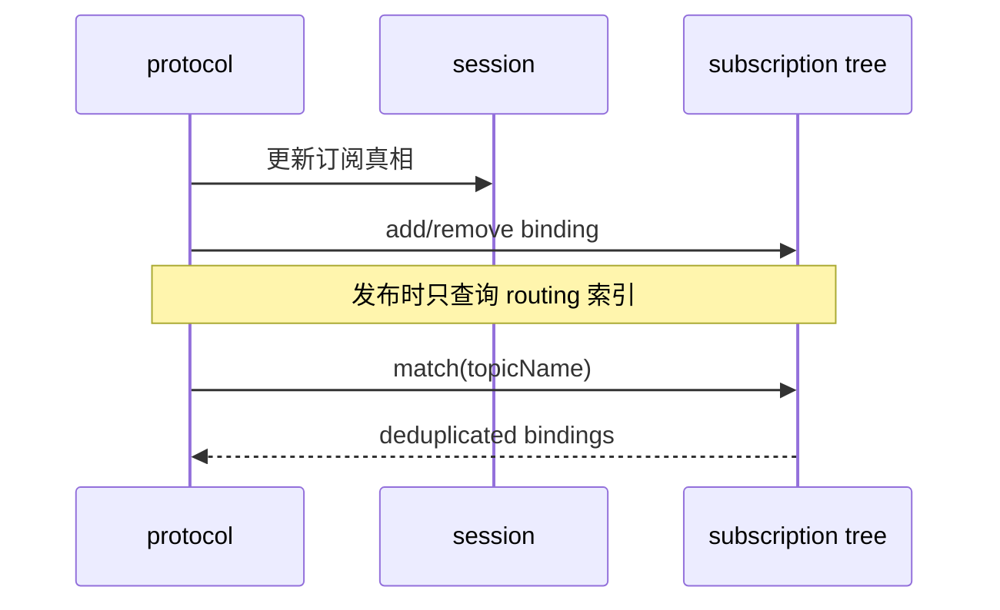

# Topic 匹配流程

本文档定义订阅注册、取消订阅和 PUBLISH 匹配时，Broker 如何使用订阅树。内部结构看 [`../02-architecture/subscription-tree-model.md`](../02-architecture/subscription-tree-model.md)。

## 目标

- 明确订阅树接入后的长期匹配行为
- 明确重叠订阅去重与 QoS 选择规则
- 保持外部协议行为与订阅树重构前一致

## 路由处理时序

## 订阅注册

1. 协议层先校验 Topic Filter 合法性
2. `session` 写入订阅真相
3. `routing` 将绑定插入订阅树
4. 若 `routing` 插入失败，则回滚 `session`

## 取消订阅

1. 协议层先校验 Topic Filter
2. `session` 删除订阅真相
3. `routing` 删除对应绑定
4. 删除后若路径已空，则执行安全剪枝

## PUBLISH 匹配

1. 协议层先校验 Topic Name
2. `routing` 按 topic level 遍历订阅树
3. 收集：
   - 精确路径命中
   - `+` 路径命中
   - 路径上的 `#` 终结命中
4. 对同一客户端去重
5. 对重叠命中选择更高 `grantedQos`
6. 将最终绑定集合交回协议层继续做在线投递、离线入队或 retained replay

## 重叠订阅规则

- 同一客户端即使被多个 filter 命中，仍只投递一次
- 该行为保持与当前 ADR 一致，不因订阅树引入而改变

## 当前不做的能力

- Shared Subscription 的组内挑选
- `Subscription Options`
- `Subscription Identifier`
- 与 retained store 的联合优化

## 当前实现边界

- 当前订阅树只承担路由索引职责
- 当前匹配结果仍然是基础 `SubscriptionBinding`
- 当前外部协议行为保持不变，重构只发生在内部索引层
