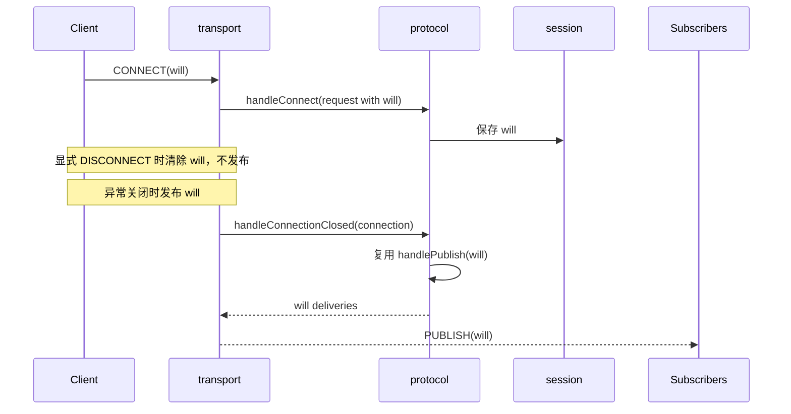

# Will Message 流程

本文档定义 Broker 对 Will Message 的长期协议行为。内部状态归属看 [`../02-architecture/will-message-model.md`](../02-architecture/will-message-model.md)。

## 目的

- 明确 CONNECT 如何保存 will
- 明确哪些关闭路径会触发 will
- 明确 will 与 Retained Message、QoS 1 的交互

## 基础规则

- CONNECT 携带 will 时，Broker 保存 will
- 显式 `DISCONNECT` 不触发 will
- 网络断开、Keep Alive 超时、协议错误断连、连接接管导致的旧连接关闭都触发 will
- will 发布复用普通 `PUBLISH` 主链路

## 处理时序

## CONNECT 保存 will

- 若 CONNECT 未携带 will，则当前连接与会话不保存 will
- 若 CONNECT 携带 will，则：
- `session` 保存当前会话生效中的 will
- `ClientConnection` 保存本连接的 will 快照

## 显式 DISCONNECT

- 客户端发送 `DISCONNECT` 时：
- 连接进入 `DISCONNECTING`
- 当前会话和连接上的 will 都被清除
- 后续 socket 真正关闭时，不再发布 will

## 异常关闭

以下路径统一视为异常关闭：

- 网络关闭
- Keep Alive 超时
- 协议错误导致的服务端断开
- 连接接管导致旧连接关闭

这些路径在 `handleConnectionClosed(...)` 中都会触发 will 发布。

## will 发布语义

- will 被转换为一次内部 `PublishRequest`
- 复用普通 publish 主链路
- 因此 will 自动继承：
- 在线订阅者即时投递
- 离线持久会话的 QoS 1 入队
- `retain=true` 时写入 retained store

## 协议版本差异

### MQTT 3.1.1

- 基础 will 语义支持
- 不存在高级 will 属性

### MQTT 5

- 当前支持基础 will 语义
- 当前不支持 `Will Delay Interval` 与其他高级 will properties

## 当前实现边界

- 已实现基础 will 保存、显式断连抑制、异常关闭发布
- 已实现 will 与 Retained Message、QoS 1 主链路联动
- 未实现 `Will Delay Interval`
- 未实现跨重启 will 保留
