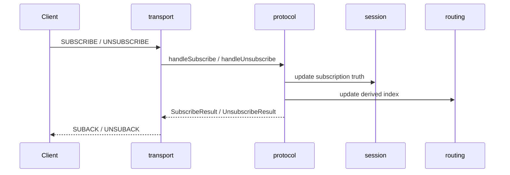

# SUBSCRIBE / UNSUBSCRIBE 流程

本文档描述 Broker 对订阅与退订报文的长期处理规则。当前完成度看 [`../../01-status/mqtt5-feature-matrix.md`](../../01-status/mqtt5-feature-matrix.md)。

## 目的与范围

- 接收并校验 Topic Filter
- 更新会话视图和路由视图
- 对成功注册的订阅项下发匹配的 retained 消息
- 返回 SUBACK / UNSUBACK

## 输入报文与关键字段

### SUBSCRIBE

- Topic Filter 列表
- Requested QoS

### UNSUBSCRIBE

- Topic Filter 列表

## 交互时序

## broker 处理流程

### SUBSCRIBE

1. `transport` 将每个订阅项转换为内部 `SubscriptionItem`
2. `protocol` 校验连接状态、Topic Filter 和请求 QoS
3. `session` 记录该 `clientId` 的订阅集合
4. `routing` 更新 Topic Filter 索引
5. `protocol` 查询匹配的 retained 消息并组装 retained deliveries
6. `transport` 根据协议版本返回 SUBACK，并在其后下发 retained 消息

### UNSUBSCRIBE

1. `transport` 提取待移除的 Topic Filter 列表
2. `protocol` 校验 Topic Filter
3. `session` 与 `routing` 删除对应订阅
4. `transport` 根据协议版本返回 UNSUBACK

## 成功路径

- 合法 Topic Filter 被注册或移除
- 订阅状态在 `session` 与 `routing` 中保持一致
- 发布路径能够立即看到最新订阅结果
- 若存在匹配的 retained 消息，则在 SUBACK 后立即收到

## 失败路径

- Topic Filter 非法：返回拒绝结果，不更新状态
- 请求 QoS 超出当前实现边界：返回失败结果
- 状态更新异常：记录协议告警，并尽量保持 `session` 与 `routing` 一致

## 协议版本差异

### MQTT 3.1.1

- SUBACK 返回 granted QoS 列表
- UNSUBACK 只返回基础确认

### MQTT 5

- SUBACK 返回 reason codes
- UNSUBACK 返回 reason codes，包括 `NO_SUBSCRIPTION_EXISTED`

## 当前实现边界

- 当前支持 QoS 0 / QoS 1 订阅授予；请求 QoS 2 时当前降为 QoS 1
- 当前不支持 Shared Subscription
- 当前未实现 subscription options 的完整语义
- 当前 retained 下发固定在 SUBACK 之后执行
